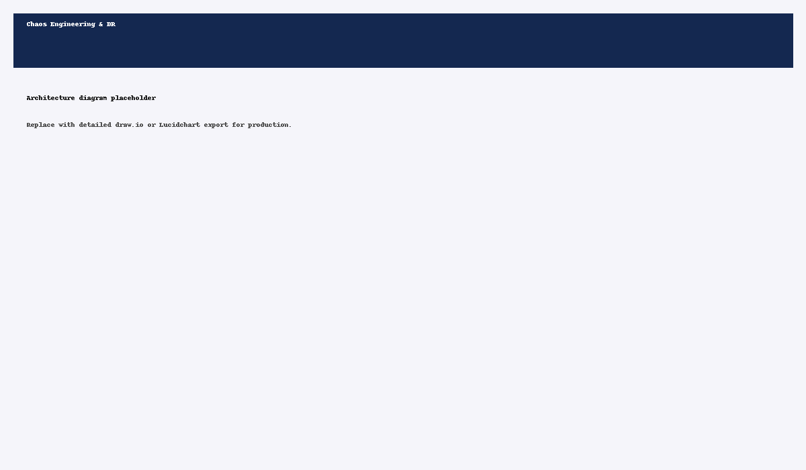

[](LICENSE)  [](https://www.python.org)

# Chaos Engineering & DR Automation

AWS FIS experiments, RTO checks, and dashboards.

## Run (pseudo)
```
terraform init && terraform apply
python rto_check.py
```

## Architecture


## Environment
Copy `.env.template` to `.env` and fill secret keys.


## Detailed Architecture

Refer to `architecture_detailed.png` for the full high-level architecture and `*_detailed.drawio` for editable source.


## Polished Architecture

See `architecture_polished.png` for a polished diagram.

